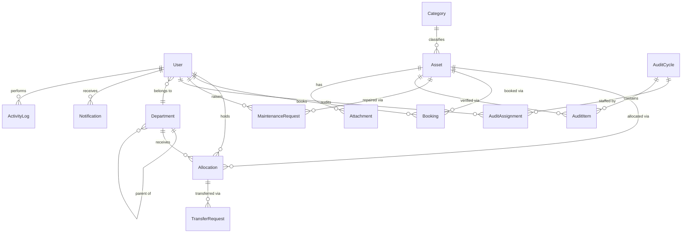
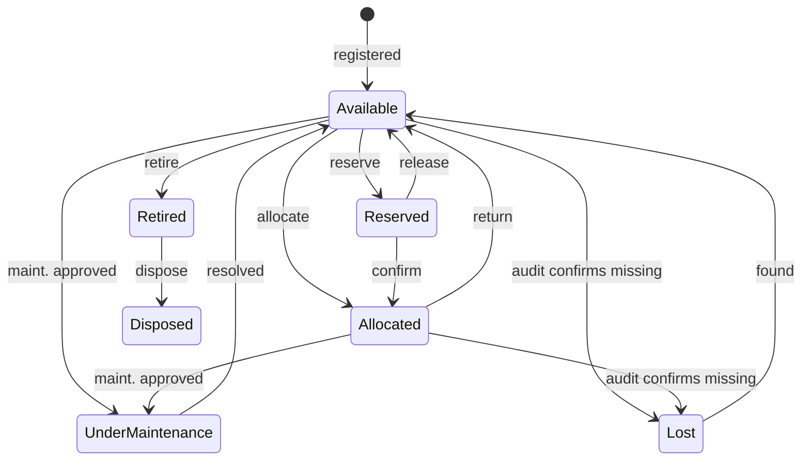

# AssetFlow — System Design & Architecture

> The engineering blueprint. Every decision here optimizes for three things, in order:
> **(1) correctness of the business rules, (2) ease of change & debugging during the hackathon, (3) demo-day reliability.**

---

## 1. Stack Decision

| Layer | Choice | Why (and what was rejected) |
|---|---|---|
| Framework | **Next.js 15 (App Router) + TypeScript** | One codebase, one deploy, file-based routing, server components for fast reads. *Rejected: separate React+Express (two deploys, CORS, duplicated types — glue work that steals hackathon hours).* |
| Database | **PostgreSQL** | Non-negotiable: partial unique indexes kill double-allocation and **exclusion constraints kill booking overlaps at the DB level** — our biggest architecture differentiator. |
| ORM | **Prisma** | Typed queries, painless migrations, schema-as-documentation. Raw SQL escape hatch for the two constraints Prisma can't express. |
| Auth | **Auth.js (NextAuth v5), Credentials provider, JWT sessions** | Email+password per spec; role embedded in session token; middleware route guards. *Rejected: rolling our own session store (time sink, security risk).* |
| Validation | **Zod** | One schema per operation, shared by client form + API boundary. Errors are structured, not strings. |
| UI | **Tailwind + shadcn/ui** | Fast, consistent, accessible components; looks designed, not templated. |
| Charts | **Recharts** | Heatmap, utilization trends, KPI sparklines. |
| Email | **Resend** (adapter-wrapped; console transport in dev) | Booking reminders & overdue alerts. Swappable interface — demo works even if email fails. |
| File storage | **Local `/uploads` in dev, Vercel Blob in prod**, behind a `FileStorage` interface | Asset photos & maintenance attachments. One function to swap providers. |
| Jobs | **Vercel Cron → `/api/jobs/*` routes** (secret-protected) | Overdue-return scanner, booking reminders, booking status roll-forward. Locally: `node-cron` script hitting the same endpoints — same code path. |
| Deploy | **Vercel + Neon (Postgres)** | Free tier, zero-ops, preview deploys for the team. |

---

## 2. Architectural Style: Modular Monolith, Strictly Layered

The spec demands "proper ERP architecture, reusable modules." We deliver that as a **modular monolith** — one deployable, but internally split into domain modules that only talk through their service interfaces.

```
        ┌──────────────────────────────────────────────────────┐
        │  PRESENTATION   Next.js pages (RSC reads) + API      │
        │                 routes /api/v1/* (all writes)        │
        ├──────────────────────────────────────────────────────┤
        │  HTTP BOUNDARY  zod validation · auth session ·      │
        │                 permission check · error mapping     │
        ├──────────────────────────────────────────────────────┤
        │  SERVICE LAYER  modules/<domain>/service.ts          │
        │                 ALL business rules & state machines  │
        │                 live here — framework-free, testable │
        ├──────────────────────────────────────────────────────┤
        │  DATA LAYER     Prisma + Postgres constraints        │
        │                 (the last line of defense)           │
        └──────────────────────────────────────────────────────┘
    cross-cutting: activityLog · notifications · fileStorage · authz
```

**The three rules that keep this debuggable:**

1. **Business logic lives only in services.** Pages and API routes are thin: parse → authorize → call service → shape response. If a rule misbehaves, there is exactly one file to open.
2. **Modules don't import each other's repositories** — only each other's services. `allocation.service` may call `asset.service.transition()`, never `prisma.asset.update()` directly.
3. **Every state change goes through the state machine helper** (§6) and **emits an activity-log entry + notifications inside the same DB transaction**. Nothing changes silently.

### Folder structure

```
src/
├── app/                          # Next.js App Router
│   ├── (auth)/login, signup, forgot-password
│   ├── (app)/                    # authenticated shell (sidebar + topbar)
│   │   ├── dashboard/
│   │   ├── organization/         # admin: depts | categories | employees tabs
│   │   ├── assets/               # directory, [id] detail, register
│   │   ├── allocations/
│   │   ├── bookings/
│   │   ├── maintenance/
│   │   ├── audits/
│   │   ├── reports/
│   │   └── activity/             # notifications + logs
│   └── api/
│       ├── v1/<domain>/...       # REST write endpoints
│       └── jobs/                 # cron targets (overdue, reminders)
├── modules/                      # THE CORE — framework-free domain logic
│   ├── auth/        (service, validators)
│   ├── org/         (departments, categories, directory)
│   ├── asset/       (registry, lifecycle state machine, tag generator)
│   ├── allocation/  (allocate, return, transfer workflow)
│   ├── booking/     (slots, overlap logic, statuses)
│   ├── maintenance/ (request workflow)
│   ├── audit/       (cycles, items, discrepancy reports)
│   ├── notification/(create, mark-read, email adapter)
│   ├── activity/    (append-only logger)
│   └── report/      (aggregation queries, CSV export)
├── lib/                          # shared kernel
│   ├── db.ts                     # Prisma singleton
│   ├── authz.ts                  # permission matrix + requirePermission()
│   ├── errors.ts                 # typed AppError hierarchy
│   ├── stateMachine.ts           # generic transition validator
│   ├── storage.ts                # FileStorage interface + impls
│   └── api.ts                    # route handler wrapper (validate→authz→handle→mapError)
├── components/                   # ui/ (shadcn) + domain components
└── prisma/
    ├── schema.prisma
    ├── migrations/               # incl. raw SQL for constraints
    └── seed.ts                   # idempotent demo org
```

---

## 3. Data Model (ERD)



### Tables (Prisma-level detail)

**User** — `id, name, email (unique), passwordHash, role (ADMIN|ASSET_MANAGER|DEPT_HEAD|EMPLOYEE, default EMPLOYEE), departmentId?, status (ACTIVE|INACTIVE), createdAt`
*Signup can only ever write role=EMPLOYEE; role changes go through `org.service.promote()` (admin-gated).*

**PasswordResetToken** — `id, userId, tokenHash, expiresAt, usedAt?`

**Department** — `id, name, headId? → User, parentId? → Department, status, createdAt`

**Category** — `id, name, description?, fieldDefs JSONB` — e.g. `[{key:"warrantyMonths", label:"Warranty (months)", type:"number"}]`. Assets store matching values in `Asset.attributes` JSONB. *One flexible mechanism instead of a table-per-category explosion.*

**Asset** — `id, assetTag (unique, "AF-0001"), name, categoryId, serialNumber?, acquisitionDate?, acquisitionCost? (display/ranking only), condition (NEW|GOOD|FAIR|POOR), locationId?/location, status (AssetStatus), isBookable bool, attributes JSONB, photoUrl?, createdById, createdAt, updatedAt`
Tag generation: `AssetTagCounter` single-row table incremented inside the registration transaction — gapless, race-safe.

**Allocation** — `id, assetId, holderUserId? XOR holderDeptId?, allocatedById, allocatedAt, expectedReturnAt?, returnedAt?, returnCondition?, returnNotes?, status (ACTIVE|RETURNED)`
🔒 `CREATE UNIQUE INDEX one_active_allocation ON "Allocation"("assetId") WHERE status = 'ACTIVE';`

**TransferRequest** — `id, allocationId, assetId, requestedById, targetUserId?/targetDeptId?, reason?, status (REQUESTED|APPROVED|REJECTED|COMPLETED), decidedById?, decidedAt?, createdAt`

**Booking** — `id, assetId (isBookable=true), bookedById, forDeptId?, startsAt, endsAt, purpose?, status (CONFIRMED|CANCELLED), reminderSentAt?, createdAt`
🔒 Exclusion constraint (§5). *Upcoming/Ongoing/Completed are **derived** from `now()` vs the range — no cron needed to flip rows, no stale states. Only CANCELLED is stored.*

**MaintenanceRequest** — `id, assetId, raisedById, title, description, priority (LOW|MEDIUM|HIGH|CRITICAL), photoUrl?, status (PENDING|APPROVED|REJECTED|ASSIGNED|IN_PROGRESS|RESOLVED), decidedById?, decidedAt?, technicianName?, assignedAt?, resolvedAt?, resolutionNotes?, createdAt`

**AuditCycle** — `id, name, scopeDeptId?/scopeLocation?, startsAt, endsAt, status (OPEN|CLOSED), createdById, closedAt?`
**AuditAssignment** — `id, cycleId, auditorUserId` (unique pair)
**AuditItem** — `id, cycleId, assetId (unique per cycle), result (PENDING|VERIFIED|MISSING|DAMAGED), notes?, checkedById?, checkedAt?`
*Items are snapshotted into the cycle at creation from its scope. The discrepancy report = `AuditItem where result in (MISSING, DAMAGED)` — generated by query, always current, nothing to sync.*

**Notification** — `id, userId, type (enum of the 8 spec events), title, body, entityType?, entityId?, readAt?, createdAt`

**ActivityLog** — append-only: `id, actorId, action ("asset.allocated"), entityType, entityId, meta JSONB (before/after snippets), createdAt`. No update/delete path exists in code.

**Attachment** — `id, ownerType (ASSET|MAINTENANCE), ownerId, url, filename, uploadedById, createdAt`

---

## 4. Authorization (RBAC)

Single source of truth: a **permission matrix** in `lib/authz.ts`, mirroring the spec's role table:

```ts
const PERMISSIONS = {
  "org.manage":            ["ADMIN"],
  "role.assign":           ["ADMIN"],
  "audit.cycle.manage":    ["ADMIN"],
  "asset.register":        ["ASSET_MANAGER"],
  "asset.allocate":        ["ASSET_MANAGER"],
  "transfer.approve":      ["ASSET_MANAGER", "DEPT_HEAD"],   // dept head: own dept only
  "maintenance.approve":   ["ASSET_MANAGER"],
  "return.approve":        ["ASSET_MANAGER"],
  "booking.create":        ["EMPLOYEE", "DEPT_HEAD", "ASSET_MANAGER", "ADMIN"],
  "maintenance.raise":     ["EMPLOYEE", "DEPT_HEAD", "ASSET_MANAGER", "ADMIN"],
  "report.orgWide":        ["ADMIN"],
  // ...
} as const;
```

- Checked in **one place**: the API wrapper calls `requirePermission(session, perm, scope?)` before the service runs. Scoped rules (dept head → own department; employee → own assets) are `scope` predicates next to the matrix, not scattered `if`s.
- **Auditor is a capability, not a role**: any user listed in `AuditAssignment` for an open cycle may check items of that cycle.
- UI hides what you can't do; API enforces it regardless (UI is convenience, API is security).
- Middleware protects the `(app)` route group: no session → `/login`.

---

## 5. Concurrency & Integrity — the Two Killer Constraints

Business rules are enforced **three times**: UI (friendly UX) → service (friendly error message) → **database (correctness under race conditions)**. Two users clicking "allocate" simultaneously cannot both win.

### 5.1 Double-allocation (partial unique index)

```sql
CREATE UNIQUE INDEX one_active_allocation
  ON "Allocation"("assetId") WHERE status = 'ACTIVE';
```

`allocation.service.allocate()` runs a transaction: check asset status → insert Allocation → transition asset → log + notify. If a race slips past the check, the index fires; we catch the unique-violation and return the same typed `ConflictError("currently held by Priya", { transferable: true })` the pre-check produces — the UI shows the **Transfer Request** button either way.

### 5.2 Booking overlap (exclusion constraint)

```sql
CREATE EXTENSION IF NOT EXISTS btree_gist;
ALTER TABLE "Booking" ADD CONSTRAINT no_overlap
  EXCLUDE USING gist (
    "assetId" WITH =,
    tstzrange("startsAt", "endsAt", '[)') WITH &&
  ) WHERE (status = 'CONFIRMED');
```

- `'[)'` (half-open range) natively encodes the spec's boundary rule: 9:00–10:00 and **10:00**–11:00 do *not* overlap; 9:30–10:30 does.
- Cancelled bookings are excluded, so a freed slot is instantly rebookable.
- Reschedule = same transaction: update times, constraint re-validates atomically.
- All timestamps stored **UTC**, rendered in the org's timezone on the client.

Both live in a hand-written SQL migration (Prisma can't express them) — `prisma/migrations/xxx_constraints/migration.sql`.

---

## 6. State Machines (one generic engine, five machines)

`lib/stateMachine.ts` exports a tiny validator: `transition(machine, from, to)` throws `InvalidTransitionError` unless the edge is declared. Every status field in the system changes **only** through it — this is the single biggest debuggability win: an illegal state change is impossible, and every legal one is logged.

### Asset lifecycle


### Maintenance
`PENDING → APPROVED | REJECTED` · `APPROVED → ASSIGNED → IN_PROGRESS → RESOLVED`
Side effects: on APPROVED → asset ⇒ UnderMaintenance; on RESOLVED → asset ⇒ Available (or back to Allocated if it had an active allocation). Guard: an asset may have at most one non-terminal maintenance request.

### Transfer
`REQUESTED → APPROVED → COMPLETED` or `REQUESTED → REJECTED`
On APPROVED, atomically: close old allocation (RETURNED) → create new ACTIVE allocation → asset stays Allocated → history reflects both.

### Booking
Stored: `CONFIRMED | CANCELLED`. Displayed: Upcoming/Ongoing/Completed derived from time. Only edge: `CONFIRMED → CANCELLED` (allowed until `endsAt`).

### Audit cycle
`OPEN → CLOSED` (admin). Closing, in one transaction: lock cycle → items still PENDING recorded as unchecked in the report → confirmed MISSING assets ⇒ Lost, DAMAGED assets get an auto-raised maintenance request (PENDING) → notifications fired.

---

## 7. API Surface (REST, `/api/v1`)

All writes go through REST route handlers (curl-able, testable, loggable). Reads happen in server components calling services directly — no waterfall, no duplicated endpoints.

```
POST   /auth/signup                       # employee only
POST   /auth/forgot-password | /auth/reset-password
# session endpoints via Auth.js

POST/PATCH  /departments[, /:id]          # admin
POST/PATCH  /categories[, /:id]           # admin
PATCH       /users/:id/role | /users/:id  # admin (promote/deactivate)

POST   /assets                            # register (manager)
PATCH  /assets/:id
POST   /assets/:id/retire | /dispose
GET    /assets?query&category&status&dept&location   # directory search
GET    /assets/by-tag/:tag                # QR scan target

POST   /allocations                       # 409 ConflictError if held
POST   /allocations/:id/return
POST   /transfers                         # raise
POST   /transfers/:id/approve | /reject

GET    /bookings?assetId&from&to          # calendar feed
POST   /bookings                          # 409 on overlap
POST   /bookings/:id/cancel | /reschedule

POST   /maintenance
POST   /maintenance/:id/approve | /reject | /assign | /start | /resolve

POST   /audit-cycles                      # admin
POST   /audit-cycles/:id/items/:itemId/check   # auditor: result+notes
POST   /audit-cycles/:id/close
GET    /audit-cycles/:id/report           # discrepancy report (+CSV)

GET    /notifications  · POST /notifications/read
GET    /reports/utilization | /booking-heatmap | /maintenance-frequency | /dept-allocation  (+ ?format=csv)

POST   /uploads                           # returns URL (storage adapter)
POST   /jobs/scan-overdue | /jobs/booking-reminders    # cron, CRON_SECRET header
```

**Uniform envelope & error contract** (`lib/api.ts` wrapper):
`{ data }` on success · `{ error: { code, message, details? } }` on failure.
Typed errors map 1:1 to HTTP: `ValidationError→400`, `AuthError→401`, `ForbiddenError→403`, `NotFound→404`, `ConflictError→409`, `InvalidTransitionError→422`. Every request gets a `requestId` echoed in errors and logged — debugging = grep one id.

---

## 8. Cross-Cutting Services

### Notifications
`notification.service.emit(type, recipients, entity)` is called by domain services **inside their transaction** (row insert) ; email dispatch happens after commit (fire-and-forget, failure logged, never blocks the workflow). Recipient resolution per event type (e.g. `TRANSFER_REQUESTED` → asset manager + relevant dept head). Bell icon polls `/notifications?unread` every 30s — polling is enough; websockets are demo-risk for zero score.

### Scheduled jobs (idempotent by design)
- **scan-overdue** (hourly): ACTIVE allocations past `expectedReturnAt` without an overdue notification in the last 24h → notify holder + manager. Overdue itself is a **derived flag** (query), so the dashboard is correct even if cron never runs — the job only adds notifications.
- **booking-reminders** (every 5 min): CONFIRMED bookings starting within 30 min, `reminderSentAt IS NULL` → notify, stamp `reminderSentAt`.

### Activity log
`activity.log(actor, action, entity, meta)` — called by every service mutation in-transaction. The `/activity` screen is a filterable read of this table. Append-only by convention *and* by code (module exposes no update/delete).

### File storage
`FileStorage { put(file): Promise<{url}> }` — `LocalDiskStorage` (dev) / `VercelBlobStorage` (prod), selected by env var. Nothing else in the codebase knows which is active.

---

## 9. Testing Strategy (focused, not exhaustive)

Hackathon-realistic: unit-test **the logic that wins or loses the demo**, integration-test the two constraints, skip UI snapshot noise.

1. **State machines** (pure functions — cheap, high value): every legal edge passes, every illegal edge throws. Table-driven.
2. **Booking overlap math**: `[9:00,10:00)` vs `[10:00,11:00)` → OK; vs `[9:30,10:30)` → conflict; cancelled ignored; reschedule into own old slot OK.
3. **Allocation conflict** (integration, real Postgres): two concurrent allocates → exactly one succeeds; the loser gets `ConflictError` with holder info.
4. **Authz matrix**: each role × forbidden endpoint → 403 (loop over the matrix — one test, full coverage).
5. **Audit close side-effects**: missing→Lost, damaged→maintenance raised, cycle locked.

Runner: Vitest; integration tests against a local Postgres (docker or Neon branch). CI: GitHub Action running lint + unit on push.

---

## 10. Seed & Demo Data (`prisma/seed.ts`, idempotent)

Fixed-ID upserts (safe to re-run): 4 departments (Engineering, Design, Operations, Facilities — Facilities parented under Operations to show hierarchy) · 5 categories with custom fields · **12 users matching the persona names in the [product plan](03-product-plan.md)** (Asha/admin, Manoj/asset-manager, Deepa/dept-head, Raj, Priya, Kiran…) · ~40 assets across states incl. laptop **AF-0114 allocated to Priya** (the scripted conflict) · Room B2 + projector as bookables with **the 9:00–10:00 booking pre-seeded** · maintenance history spread over 90 days + bookings over 3 weeks so every chart has a real shape · one open audit cycle assigned to Kiran · a deliberately **overdue** allocation so the dashboard shows the red state on load.

---

## 11. Environment & Config

```
DATABASE_URL=            # Neon / local postgres
AUTH_SECRET=             # Auth.js JWT signing
RESEND_API_KEY=          # optional — email falls back to console transport
BLOB_READ_WRITE_TOKEN=   # optional — storage falls back to local disk
CRON_SECRET=             # protects /api/jobs/*
APP_URL=                 # absolute links in emails & QR codes
```

Config is read once in `lib/config.ts` with zod validation — missing required env fails fast at boot with a named error, not a mystery 500 at demo time. Every optional integration has a local fallback: **the app must run fully on a laptop with only `DATABASE_URL` set.**

---

## 12. Build Order (maps to the [product plan](03-product-plan.md) P0 list)

| # | Milestone | Proves |
|---|---|---|
| 0 | Scaffold: Next+TS+Prisma+Auth+shadcn, schema, constraints migration, seed, CI | app boots, login works |
| 1 | Org setup (3 tabs) + RBAC + promote flow | "no self-assigned admin" |
| 2 | Asset registry + tag generator + QR + detail page | directory & search |
| 3 | Allocation/return/transfer + conflict path | killer rule #1 |
| 4 | Booking calendar + overlap + cancel/reschedule | killer rule #2 |
| 5 | Maintenance workflow + auto status flips | approval gating |
| 6 | Audit cycles + discrepancy report + close | demo climax |
| 7 | Dashboard KPIs + notifications + jobs + activity log | operational layer |
| 8 | Reports + heatmap + CSV export | analytics story |
| 9 | Seed polish, responsive pass, deploy, rehearse script | demo day |

Each milestone is independently demoable — if time runs out at any point, everything above the line still works.

---

## 13. Team Split (suggested, 4 people)

- **A (backend core):** modules `asset`, `allocation`, `booking` + constraints + state machines
- **B (workflows):** `maintenance`, `audit`, `notification`, jobs
- **C (frontend):** app shell, org setup, directory, allocation & booking UIs
- **D (frontend/data):** dashboard, reports/charts, activity, seed data, deploy

Contracts between A/B and C/D are the zod schemas + API envelope — agreed in milestone 0, so front and back build in parallel.
